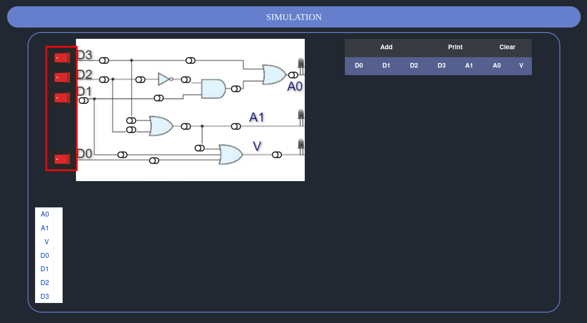
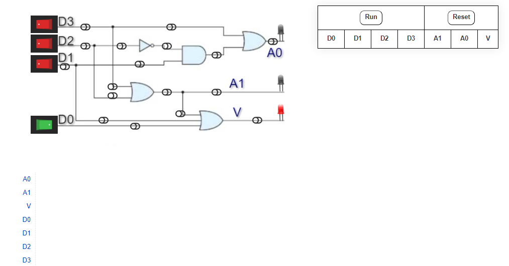
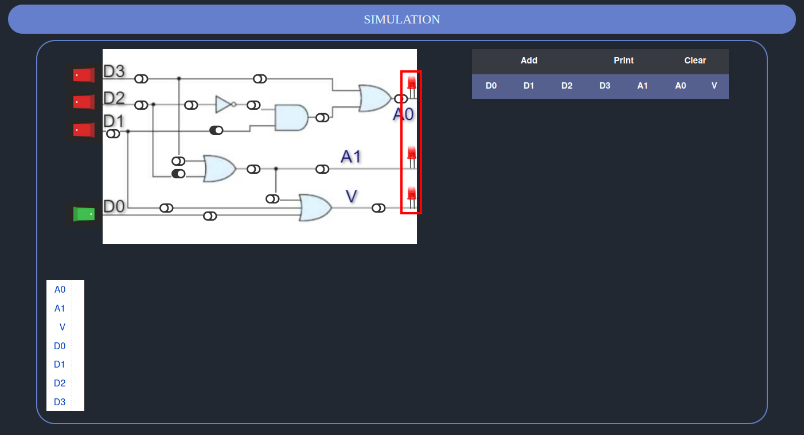
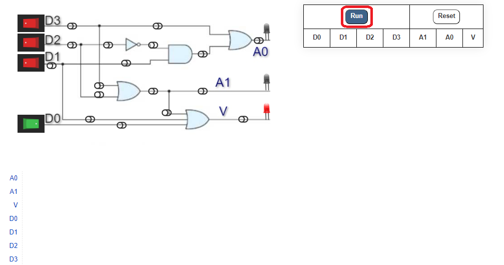
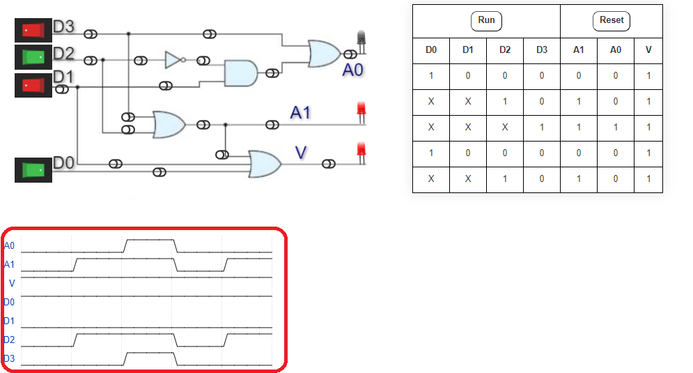
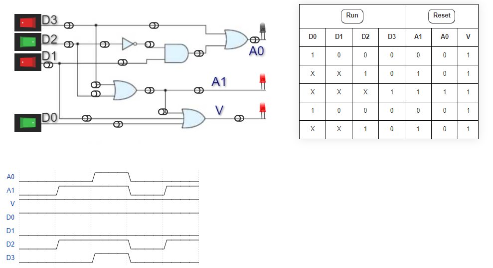
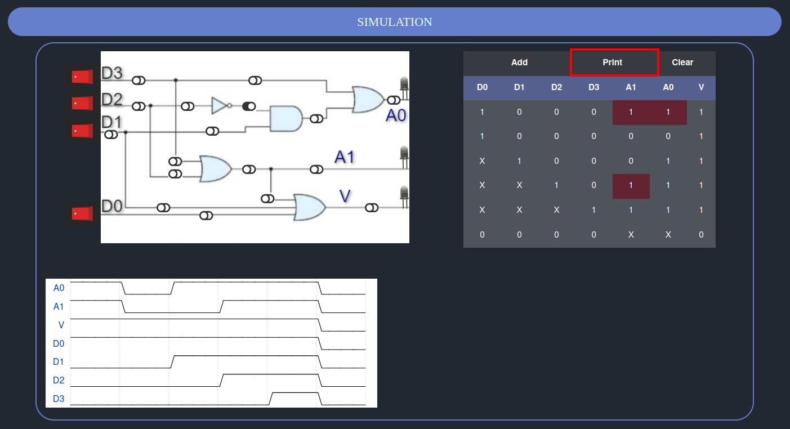
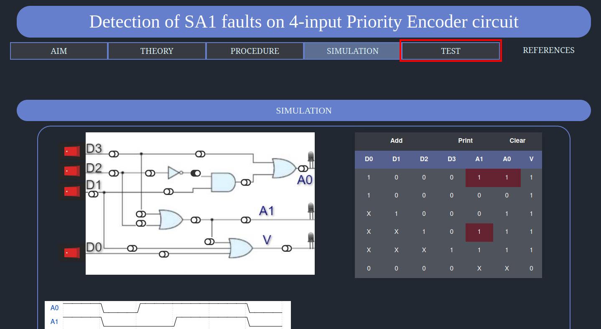

### PROCEDURE:

1. Press the respective buttons of D0, D1, D2, D3 to send an input signal.
2. To add a SA1 fault in any wire, click on the toggle button for that wire.
3. Observe the LEDs for the corresponding output.
4. Press on "ADD" button on top of the table to ADD that particular input and output set to the table.
5. Timing diagram and Table will be updated
6. Repeat the experiment with different input values and faults.
7. Finally print the table using the "PRINT" button.
8. Attend the test by pressing on the test tab.

### Step by step procedure:

1. Press the respective buttons of D0,D1,D2,D3 to send an input signal.

2. To add a SA1 fault in any wire, click on the toggle button for that wire.

3. Observe the LEDs for the corresponding output.

4. Press on "ADD" button on top of the table to ADD that particular input and output set to the table.

5. Timing diagram and Table will be updated accordingly.

6. Repeat the experiment with different input values and faults.

7. Finally print the table using the "PRINT" button.

8. Attend the test by pressing on the test tab.

