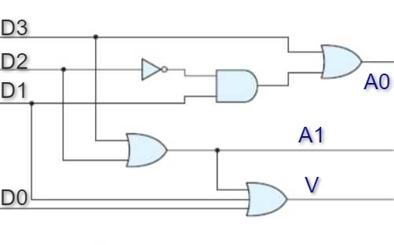
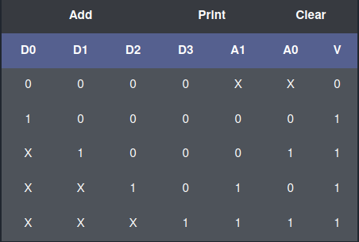
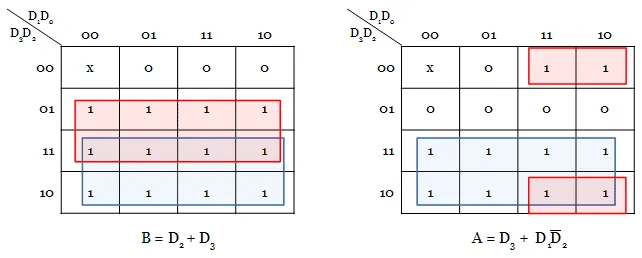

### Introduction

### Priority Encoder 

In Digital Electronics, binary encoders are multi-input combinational logic circuits that process all input lines at once and convert them into a corresponding single encoded output. An n-bit digital encoder has 2^n input lines and n output lines. To address the limitations of binary encoders, priority encoders were introduced, which operate based on the highest priority input. These priority encoders are commonly used in digital applications to select the input with the highest priority.

### 4 to 2 priority encoder 

This is also known as a 4-bit priority encoder, which has 4 input lines and 2 output lines. Since an encoder typically has 2n input lines and n output lines, the third output, labeled 'V', serves as a valid bit indicator. It is set to 1 when more than one input line is high (active, 1). If the valid bit is 0, it indicates that all input lines are low (0), and in this case, the other two output lines are treated as don't care conditions, represented by

Fig 1: Circuit for 4x2 Priority Encoder

#### Truth Table 

A truth table for 4-input priority encoder with D0, D1, D2 and D3 as inputs and A0, A1 and V as the outputs is shown below.

Fig 2: Truth Table for 4x2 Priority Encoder

#### K-Map 

From the truth table, we observe that D0, D1, D2, and D3 are the input lines, while A and B are the output lines, and V is the valid indicator line. D3 has the highest priority, and D0 has the lowest priority. The output equations can be derived from the K-map as shown below.

Fig 3: K map for a 4x2 Priority Encoder

Equations derived are:

A = D3 + D1D2'

B = D2 + D3

V = D0 + D1+ D2 + D3

### Applications 

Few applications of priority encoder are as follows:

1. Priority encoder is used to reduce the number of wires and connections required for electronic circuit designing that have multiple input lines. Example keypads and keyboards.
2. Used in controlling the position in the ship's navigation and robotics arm position.
3. Used in the detection of highest priority input in various applications of microprocessor interrupt controllers.
4. Used to protect the entire network from hackers by transmitting the binary code over the network.
5. Used to encode the analog to digital converter's output.
6. Used in synchronization of the speed of motors in industries.
7. Used in robotic vehicles.
8. Used in applications of home automation systems with RF.
9. Used in hospitals for health monitoring systems.
10. Used in secure communication systems with RF technology to enable secret code.

### Stuck at fault in circuits 

A stuck-at fault is essentially a structural-level fault. In this case, the circuit is represented as a netlist, typically at the gate and flip-flop level. This fault involves certain assumptions, such as:

1. The blocks are fault-free.
2. The Interconnections between gates is faulty.

In a stuck-at fault, we assume that some of the lines are permanently fixed at either logic '0' or logic '1'. It is one of the most widely used fault models.

Fault in a line A is denoted as : A s-a-0 or A/0 and A s-a-1 or A/1.

#### 1. Single stuck at fault 

Only one line is considered to be stuck-at fault at a time, which is the most commonly used technique. If the circuit contains K wires, the total number of single stuck-at faults will be 2K.

#### 2. Multiple stuck at fault 

Any number of circuit lines can experience a stuck-at fault. For a circuit with K lines, the number of multiple stuck-at faults is given by (3K) - 1..

##### Results 

A test that detects all single stuck-at faults can identify a significant percentage of multiple stuck-at faults, often more than 95%.

