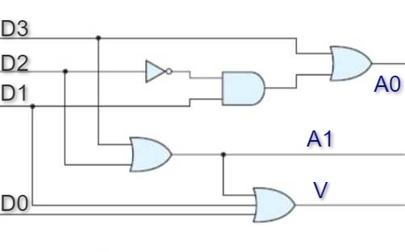
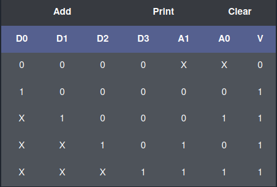
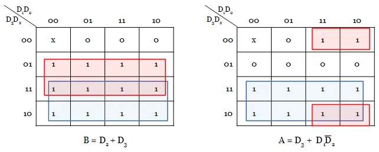

### Theory

### Priority Encoder :

In Digital Electronics, the binary encoders are the multi-input combinational logic circuits, which consider all the input lines simultaneously and then convert them into an equivalent single encoded output. An n-bit digital encoder contains 2^n input lines and n output lines. To overcome the disadvantages of binary encoders, priority encoders were developed that work based on the highest priority input. In most digital applications, these encoders are used to select the inputs, which have the highest priority level.

### 4 to 2 priority encoder :

This is also referred to as 4- bit priority, which consists of 4 inputs and 2 output lines. Since an encoder contains 2^n input lines and n output lines. The third output is 'V', which is considered as a valid but indicator and it is set to 1 when more than one input line is high or active (1). If the valid bit is equal to '0', then all the inputs are '0'. In this case, the other 2 output lines are considered as don't care conditions denoted by 'X'.

Fig 1: Circuit for 4x2 Priority Encoder

### Truth Table :

A truth table for 4-input priority encoder with D0, D1, D2 and D3 as inputs and A0, A1 and V as the outputs is shown below.

Fig 2: Truth Table for 4x2 Priority Encoder

### K-Map :

From the truth table we can see that D0,D1,D2 and DE are inputs lines and A,B are the output lines and V is a valid Indicator line.The D3 has highest priority and D0 had Lowest priority. We can find the equation of output from K-Map as below.

Fig 3: K map for a 4x2 Priority Encoder

Equations derived are:

A = D3 + D1D2'

B = D2 + D3

V = D0 + D1+ D2 + D3

### Applications :

Some of the applications of priority encoder are,

1. It is used to reduce the number of wires and connections required for electronic circuit designing that have multiple input lines. Example keypads and keyboards.
2. Used in controlling the position in the ship's navigation and robotics arm position.
3. Used in the detection of highest priority input in various applications of microprocessor interrupt controllers.
4. Used to protect the entire network from hackers by transmitting the binary code over the network.
5. Used to encode the analog to digital converter's output.
6. Used in synchronization of the speed of motors in industries.
7. Used in robotic vehicles.
8. Used in applications of home automation systems with RF.
9. Used in hospitals for health monitoring systems.
10. Used in secure communication systems with RF technology to enable secret code.

### Stuck at fault in circuits :

Basically a stuck at fault is a structural level fault. In this we take a circuit as a net list, typically at the level of gates and flip-flops. In this Fault there are some assumptions

- The blocks are fault-free.
- The Interconnections between gates is faulty.

In stuck at fault we assume that some of the lines are permanently stuck at logic '0' or logic '1'. It's a very popular fault model.

Fault in a line A is denoted as : A s-a-0 or A/0 and A s-a-1 or A/1.

In our circuit we can see that there are 4 input lines, D0, D1, D2 and D3. If we consider the stuck at faults one at a time, we get the following possibilities - D0/0, D0/1, D1/0, D1/1, D2/0, D2/1, D3/0, D3/1, So 8 single stuck at faults are present.

#### 1. Single stuck at fault :

only one of the lines is taken as stuck at fault at a time. This is the most widely used technique. If our circuit consists of K number of wires, then number of single stuck at faults is 2K.

#### 2. Multiple stuck at fault :

Any number of circuit lines can be at stuck at fault. For a circuit consisting of K lines the number of Multiple stuck at faults is ((3K)-1).

##### Some results :

A test that detect all single stuck at faults detects large percentage of Multiple stuck at faults(>95%).
